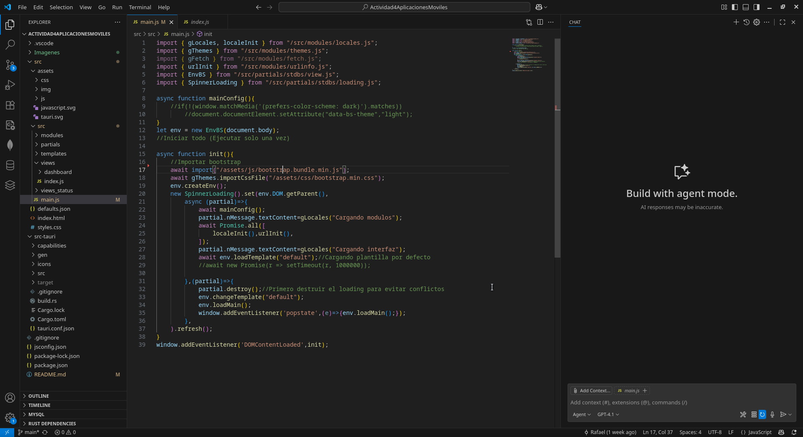
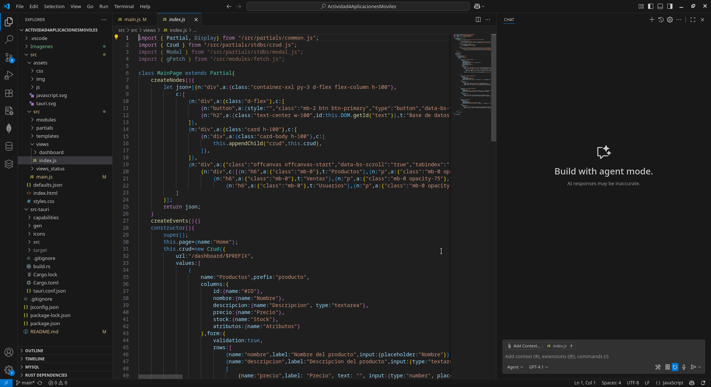
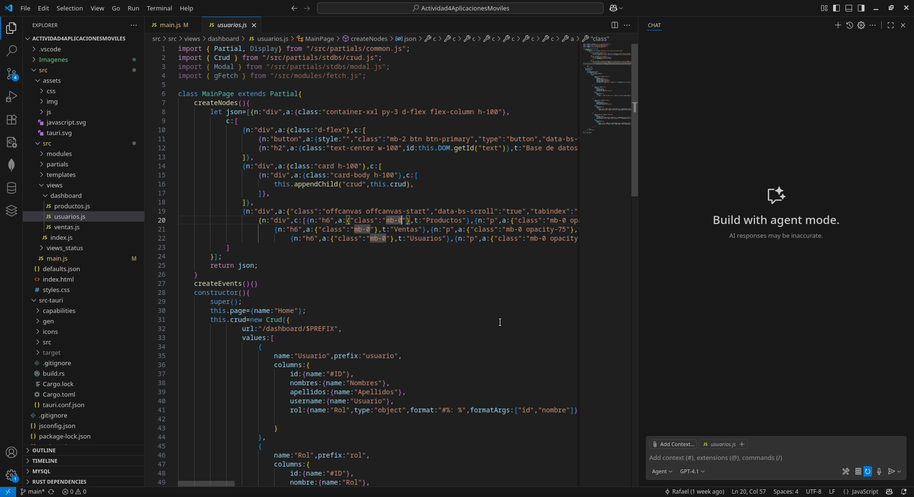
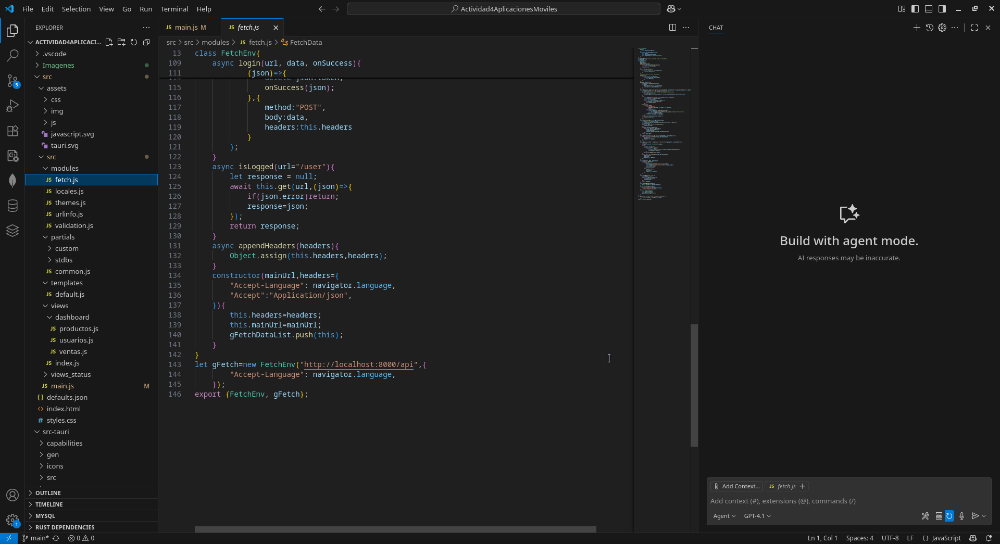
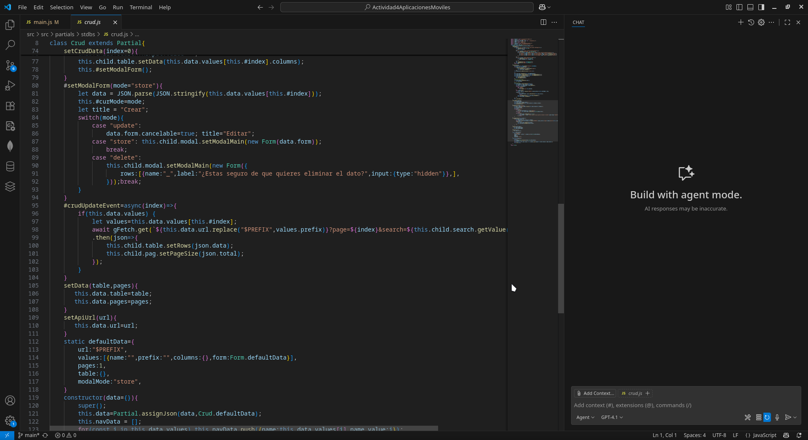
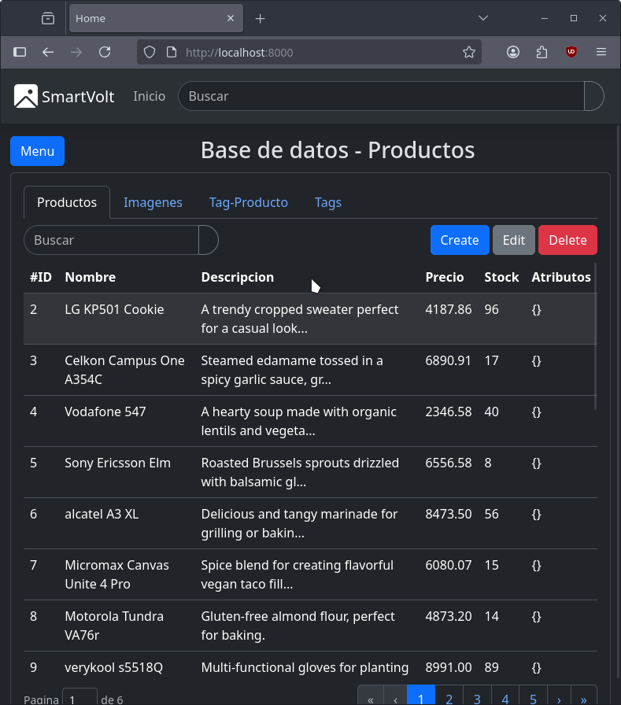
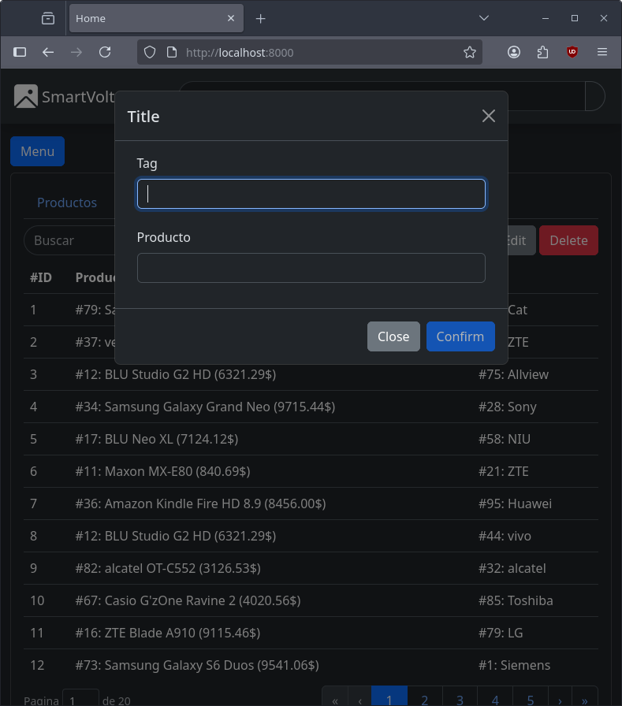
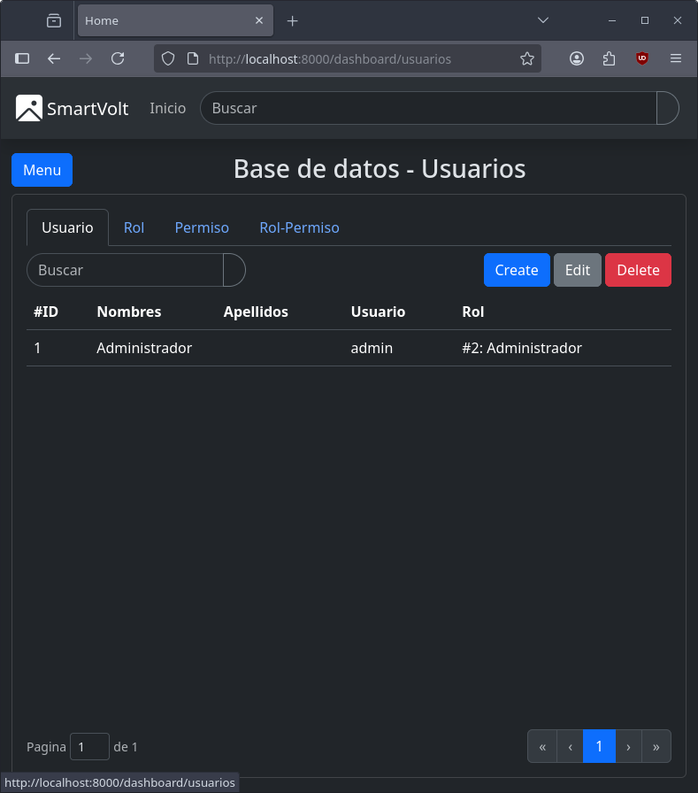

# Actividad 4 - Aplicaciones Móviles

## Gestor de inventario
Hecho en tauri

---
## 1. Script principal de la interfaz

## 2. Vista general del CRUD

## 3. Vista de otras tablas

## 4. Modulo que maneja las consultas

## 5. Crud

## 6. Tablas de la aplicacion

## 7. Opcion de crear dato

## 8. Otras tablas como usuario

**Autor:** Rafael Kadir Oporto Valencia
